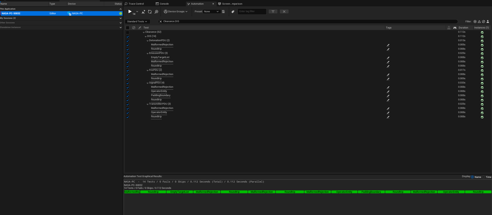
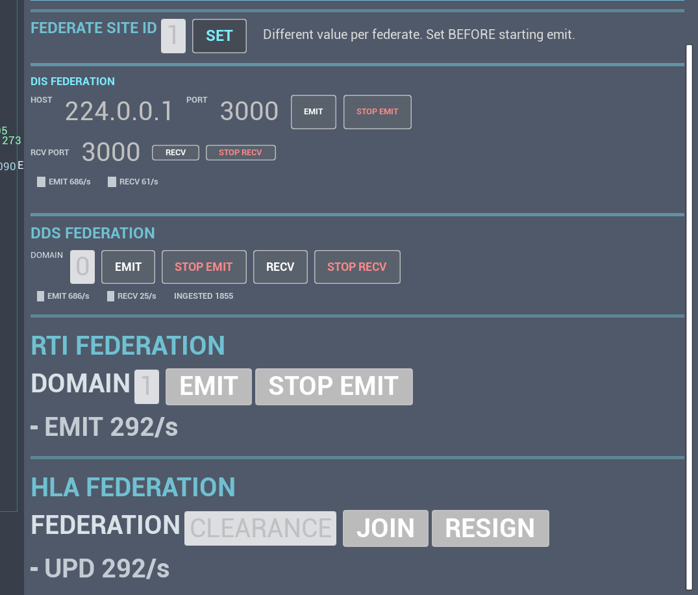
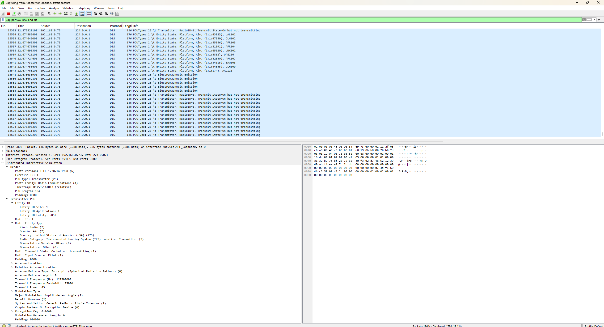
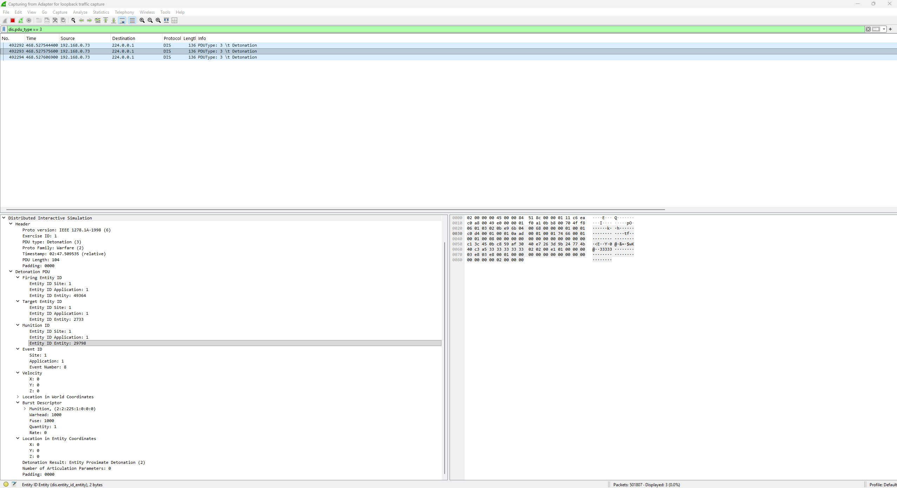
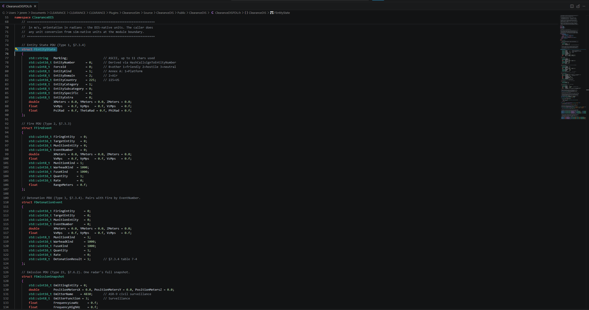
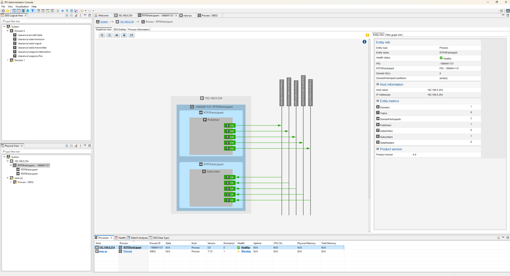
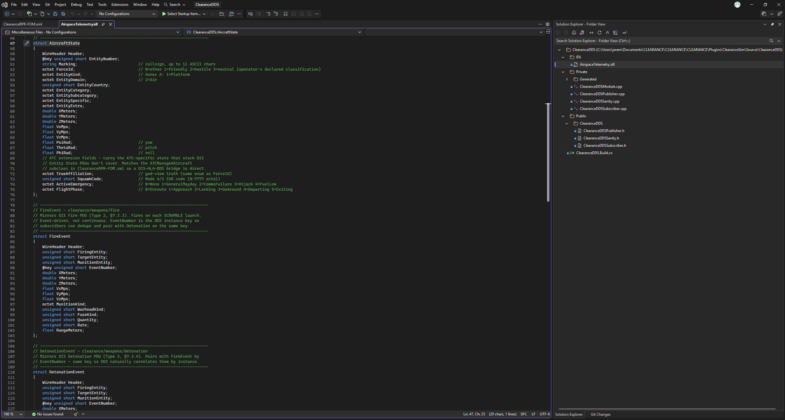
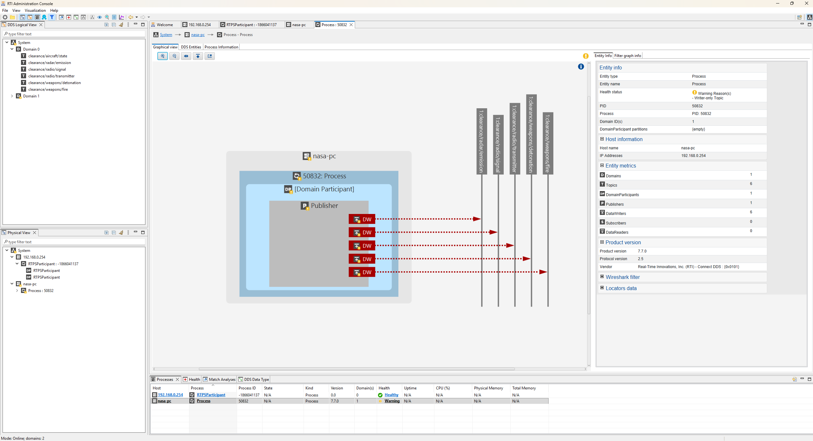
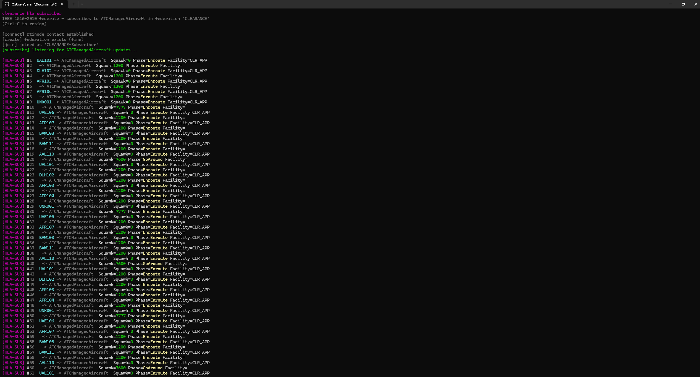
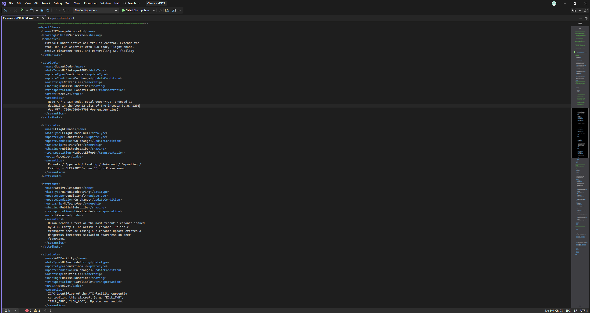

# clearance-federation

Four independent simulation-interoperability wires publishing the
same six data primitives from a single sim tick out of **CLEARANCE**,
a UE5 air traffic control and defence training simulator I built.

- **IEEE 1278.1-2012** DIS (protocol version 6) over UDP multicast, in-house wire codec
- **OMG DDS** via eProsima Fast DDS 3.6.1
- **OMG DDS** via RTI Connext 7.7.0 (commercial parallel runtime)
- **IEEE 1516-2010 HLA Evolved** via OpenRTI 0.10.0, RPR FOM 2.0 extension

All four run concurrently against the same authoritative airspace
state. The same aircraft state decodes field-by-field in Wireshark's DIS dissector as an Entity State PDU, byte-verified against the spec, appears in RTI Administration Console as a discoverable DomainParticipant with six DataWriters, and lands in
an HLA federation as an `ATCManagedAircraft` object with encoded
attributes. Same tick, four wires, three vendor runtimes plus an in-house codec, no shared serialisation code between them.

This is a read-only mirror of the four federation modules as they
live inside CLEARANCE. It does not build on its own. It exists so
the architecture is visible without navigating the full game
project.

Companion Model-Based Design repos from the same simulator:

- [Simulink cascade autopilot](https://github.com/abdullahabduljabbarab/autopilot-mbd)
- [Simulink radar signal chain](https://github.com/abdullahabduljabbarab/radar-mbd)

## The four wires

```
                            +--> ClearanceDIS   ->  UDP multicast (IEEE 1278.1a-2012)
                            |                       6 PDU types, in-house spec-compliant codec
                            |
                            +--> ClearanceDDS   ->  RTPS via Fast DDS 3.6.1
   Sim tick    Snapshot     |                       6 topics, OMG IDL schema
   (server)  --------------+
                            |
                            +--> ClearanceRTI   ->  RTPS via RTI Connext 7.7.0
                            |                       Same 6 topics, commercial parallel runtime
                            |
                            +--> ClearanceHLA   ->  IEEE 1516-2010 via OpenRTI 0.10.0
                                                    RPR FOM 2.0 extension via FOM Module XML
```

Each wire starts and stops independently, from either the instructor panel's FEDERATION section or the console commands. Enabling all four does not rebuild the snapshot four times; the airspace state is captured once per tick and each wire marshals its own copy from that same source struct.

## DIS PDU coverage

Six IEEE 1278.1a-1998 PDU types, every one spec-compliant, every one byte-for-byte verified against `dis_wire_format.cpp` round-trip tests. Fixed-length fields sit at their spec offsets, and variable-length records are included where the PDU defines them.

| PDU type       | Type | Family                    | Spec §  | Wire size | Round-trip tests |
|----------------|------|---------------------------|---------|------------|------------------|
| Entity State   | 1    | Entity Information/Interaction        | §7.2.2  | 144 bytes (no variable parameters)  | 1                |
| Fire           | 2    | Warfare                   | §7.3.2  | 96 bytes   | 2                |
| Detonation     | 3    | Warfare                   | §7.3.3  | 104 bytes (no variable parameters)  | 2                |
| Emission       | 23   | Distributed Emission Regeneration | §7.6.2  | 100 + tracks/jam records | 3    |
| Transmitter    | 25   | Radio Communications      | §7.7.2  | 104 + modulation parameters | 1        |
| Signal         | 26   | Radio Communications      | §7.7.3  | fixed head + payload padded to 32-bit boundary | 1 |

All six live-verified against Wireshark's built-in DIS dissector.
No custom dissector, no wire-shim. The dissector decodes every field of every PDU. For Entity State that means header, entity ID triple, ECEF position, entity type kind/domain and dead reckoning parameters, all expanded in the packet tree.

## Test coverage

**52 automation test cases** covering **69 REQ-IDs** across seven
domains, tagged in each test's leading comment and runnable via
`Automation RunTests Clearance.*` in the UE Session Frontend.

| Test file                                | REQ-IDs covered       | Scope                                                              |
|------------------------------------------|-----------------------|--------------------------------------------------------------------|
| `ClearanceDISEntityStateTests.cpp`          | REQ-DIS-001..004      | Entity State PDU round-trip + ForceId at spec offset 18                |
| `ClearanceDISEmissionTests.cpp`          | REQ-DIS-011..014      | Emission PDU round-trip + malformed rejection                     |
| `ClearanceDISFireDetonationTests.cpp`    | REQ-DIS-005..010      | Fire (Type 2) + Detonation (Type 3) round-trips                    |
| `ClearanceDISSignalTests.cpp`            | REQ-DIS-019..022      | Signal PDU padding + operator-entity routing                       |
| `ClearanceDISTransmitterTests.cpp`       | REQ-DIS-015..018      | Transmitter PDU round-trip                                         |
| `ClearanceRPRFOMMappingTests.cpp`        | REQ-FED-001..006      | ForceId byte written at spec offset 18 for all 4 affiliations      |
| `ClearanceInstructionValidatorTests.cpp` | REQ-COMMS-001..010    | Instruction envelope, military bypass, non-finite rejection        |
| `ClearanceSafetyConstantsTests.cpp`      | REQ-SAFETY-001..009   | ICAO Doc 4444 wake matrix, RVSM vertical minima, sep thresholds    |
| `ClearanceScoringTests.cpp`              | REQ-SCORE-001..006    | Incident log lifecycle, points per incident, difficulty ramp       |
| `ClearanceSessionRecorderTests.cpp`      | REQ-SIM-001..008      | Start/stop lifecycle, PoseBack, events-in-range                    |
| `ClearanceRadarEquationTests.cpp`        | REQ-RADAR-001..008    | R^4 range law, RCS scaling, kTBF noise floor, Pd monotonicity      |

**Every REQ-ID cites its source**: IEEE 1278.1 sections, ICAO Doc
4444, RVSM specification, aircraft certification data, Skolnik radar
theory. The [`REQUIREMENTS.md`](REQUIREMENTS.md) companion doc
tabulates all 69, and [`V_AND_V_PLAN.md`](V_AND_V_PLAN.md) documents
the three-tier structure (unit, integration, manual) with five
manual verification procedures (Wireshark capture, RTI Admin
Console, in-process subscriber, two-federate live, automation full
pass).



*52 out of 52 tests pass locally via `Automation RunTests Clearance.*`
in the UE Session Frontend. Each test in the list corresponds to
one or more REQ-IDs in `REQUIREMENTS.md`, so a passing run is a
receipt against the requirements table above.*

## The federation panel



*All four wires running against the same running sim. DIS emitting
686 packets/sec to multicast 224.0.0.1:3000, Fast DDS publishing on domain 0 and Connext on domain 1, HLA federate joined to `CLEARANCE` federation via
OpenRTI's `rtinode.exe` at `127.0.0.1:14321`. Each wire independently
start/stop-able from the panel with a start button, stop button,
status dot, and live rate counter.*

## IEEE 1278.1 on the wire



*CLEARANCE publishing IEEE 1278.1 Entity State + Transmitter + Signal
PDUs onto UDP multicast 224.0.0.1:3000. Wireshark's built-in DIS
dissector decodes every field: PDU header, entity ID triple, ECEF
position, entity type kind/domain, dead reckoning parameters. No
custom dissector, no wire shim, just a spec-compliant buffer.*



*Detonation PDU (Type 3, §7.3.4) filtered from the wire when a
Viper intercept flight escorts a bandit out of the sector. Warfare
family PDU, spec-compliant 104 bytes, paired by EventNumber with
its earlier Fire PDU (Type 2). The intercept resolution IS the
"detonation" in DIS semantics for a non-lethal escort-out; result
byte set to 2 (Entity Proximate Detonation). Same emit path as
every other PDU, no special-case wiring.*

## Wire codec API



*`ClearanceDISPDU.h`, the entire public surface of the DIS wire codec
in a single header. POD structs, `CLEARANCEDIS_API` DLL-export macro,
Build and Parse free functions. Zero Unreal types, `std::vector` and
`std::string` and `<cstdint>` on the boundary. The `test/CMakeLists.txt`
in the same module builds the round-trip test suite against this
header with no engine dependency, which is what proves the codec is
reusable outside CLEARANCE.*

## OMG DDS via Fast DDS, discovered by RTI's own tooling



*The Fast DDS side of CLEARANCE (six DataWriters, one per topic, and six DataReaders for the in-process demo subscriber) discovered by RTI Administration Console. Product Version reads 0.0 and there is no RTI Vendor line because this participant is not RTI Connext, it's eProsima Fast DDS speaking standard OMG DDS-RTPS on the wire. The fact that RTI's tool discovers it and walks its topology is evidence the schema is vendor-neutral OMG DDS, not accidentally Fast-DDS-specific.*



*`AirspaceTelemetry.idl`, the OMG IDL schema that Fast DDS and RTI
Connext both codegen from. One IDL, two vendor runtimes, same six
topics: `AircraftState`, `EmissionSnapshot`, `TransmitterState`,
`SignalEvent`, `FireEvent`, `DetonationEvent`. Field-for-field
mapping to the DIS PDU siblings above, encoded on the wire as OMG
CDR (Common Data Representation) inside RTPS 2.5.*

## OMG DDS via RTI Connext, discovered by RTI Administration Console



*Second parallel wire from the same CLEARANCE process, this one
published through RTI Connext DDS 7.7.0. One DomainParticipant, one
Publisher, six DataWriters on the same six topics as the Fast DDS
wire. Entity Info panel shows Product Version 7.7.0, Protocol
Version 2.5, and Vendor "Real-Time Innovations, Inc. (RTI) - Connext
DDS : {0x0101}". A vendor runtime with a valid licence populates this
window. Screenshots of code do not.*

## IEEE 1516-2010 HLA-Evolved



*CLEARANCE joined to an OpenRTI federation as `CLEARANCE-Instructor`.
Federation execution name `CLEARANCE`, FOM Module XML at
`ClearanceRPR-FOM.xml` extending SISO RPR-FOM 2.0's
`HLAobjectRoot.BaseEntity.PhysicalEntity.Platform.Aircraft` with an
`ATCManagedAircraft` subclass. Attribute encoding uses HLAfloat64BE
for world coordinates, HLAinteger16BE for squawk, HLAfixedRecord
for the EntityIdentifier {Site, App, Entity} triple, HLAopaqueData
for the 11-char Marking.*



*`ClearanceRPR-FOM.xml` FOM Module extending SISO RPR-FOM 2.0's
`Aircraft` object class with an `ATCManagedAircraft` subclass carrying
CLEARANCE-specific attributes: `SquawkCode` as `HLAinteger16BE`,
`FlightPhase` as an enum, `ActiveClearance` as `HLAunicodeString`,
`ATCFacility` as `HLAunicodeString`. Every attribute declares its
full HLA semantics (sharing, transportation reliability, ordering,
ownership) per IEEE 1516-2010, with semantic comments documenting
the ATC domain rules (Mode A / 3 SSR encoding, flight-phase enum
values, ICAO facility identifiers).*

## Architecture principles

Every wire codec is a **standalone C++ module** with an engine-free
public API. Zero Unreal types across the boundary. No `FName`, no
`FVector`, no `TArray`, no `UObject`.

- **`ClearanceDIS`** exposes POD structs (`FEntityState`,
  `FFireEvent`, `FDetonationEvent`, `FEmissionSnapshot`,
  `FSignalEvent`, `FTransmitterState`) and eleven Build/Parse free
  functions. `std::vector`, `std::string`, `<cstdint>` on the
  surface, nothing else. Tests exercise the pure API directly, not
  through the UE adapter.

- **`ClearanceDDS` and `ClearanceRTI`** expose PImpl facades
  (`FClearancePublisher`, `FClearanceSubscriber` and the RTI
  equivalents) so Fast DDS / RTI Connext types don't leak across
  the module boundary. POD data types come from the vendor's IDL
  code generator.

- **`ClearanceHLA`** exposes `FClearanceHLAFederate` with a
  six-method API (`CreateFederation`, `Join`,
  `RegisterAircraftInstance`, `UpdateAircraftAttributes`,
  `PublishAircraftState`, `Resign`). All rti1516e types live inside
  the PImpl.

The Unreal-tied adapters (`UClearanceDISEmitter`,
`UClearanceDDSEmitter`, `UClearanceRTIEmitter`,
`UClearanceHLAEmitter`) are thin. They read the sim's authoritative
struct, convert to POD at the module boundary, call the pure API,
and hand results back. The wire-format code doesn't know Unreal
exists.

This is the shape a defence integrator expects. The wire format
code should be a portable protocol library, not scattered helpers
wired into a game engine. All four wires ship it that way.

## Real ABI-level integration

Getting four independent commercial runtimes to co-exist in one UE5
process required real toolchain work, not just header includes.
Notable bugs hit and fixed during OpenRTI + RTI Connext integration:

- **CMake 4.x compatibility.** OpenRTI's top-level `CMakeLists.txt`
  called `project()` before `cmake_minimum_required(VERSION 2.8.12)`,
  and CMake 4 removed compat for <3.5. Patched to insert
  `cmake_minimum_required(VERSION 3.5)` as line 1.

- **`auto_ptr` vs `unique_ptr` ABI mismatch.** `rti1516e/RTI/SpecificConfig.h`
  gates `RTI_UNIQUE_PTR` on `__cplusplus < 201703L`. MSVC reports
  `__cplusplus == 199711L` by default even in C++17 mode unless
  `/Zc:__cplusplus` is set. OpenRTI built without the flag exported
  `createRTIambassador` returning `std::auto_ptr<RTIambassador>`, but
  the UE consumer (C++20) saw `std::unique_ptr` in the header, so
  link failed at RTIambassador creation. Fixed by rebuilding OpenRTI
  with `CXXFLAGS = /EHsc /Zc:__cplusplus`.

- **`<windows.h>` pollution from rti1516e headers.** Same class of
  problem as RTI Connext: `<windows.h>` transitively leaks into UE
  headers and breaks `UE::Cook::FCookDependency`. Fixed by wrapping
  every OpenRTI include with UE's
  `AllowWindowsPlatformTypes.h` + `THIRD_PARTY_INCLUDES_START` +
  `THIRD_PARTY_INCLUDES_END` + `HideWindowsPlatformTypes.h` guard set.

- **Cross-DLL heap mismatch in Fast DDS.** Dynamic linking Fast DDS
  hit a Windows cross-DLL heap crash: Fast DDS's DLL allocated an
  `std::vector` inside its type-registration path, then `ClearanceDDS`'s
  DLL tried to free it against UE's `PerModuleInline` allocator.
  Different heaps. Switched to statically linking
  `libfastdds-3.6.lib` + `libfastcdr-2.3.lib` +
  `foonathan_memory-0.7.4.lib` + OpenSSL statics into
  `UnrealEditor-ClearanceDDS.dll`. One heap, one STL, no mismatch
  possible.

Every one of the four vendor SDKs is vendored under
`Plugins/ClearanceSim/ThirdParty/` in the parent project (headers,
libs, DLLs, and in OpenRTI's case the standalone `rtinode.exe`
federation runtime).

## Repository layout

```
clearance-federation/
|-- README.md
|-- ARCHITECTURE.md                             <-- module-by-module deep dive
|-- LICENSE                                     <-- MIT
|-- docs/
|   `-- img/                                    <-- README screenshots
|-- ClearanceDIS/                               <-- IEEE 1278.1, in-house codec
|   |-- ClearanceDIS.Build.cs                   <-- UE plugin module build script
|   |-- Public/
|   |   `-- ClearanceDIS/
|   |       `-- ClearanceDISPDU.h               <-- ALL public API in one file
|   |-- Private/
|   |   |-- ClearanceDISModule.cpp              <-- module lifecycle
|   |   `-- DISWireFormat.cpp                   <-- 6 Build + 5 Parse implementations
|   `-- test/
|       |-- CMakeLists.txt                      <-- standalone build (no UE)
|       `-- test_wire_format.cpp                <-- round-trip PDU tests
|-- ClearanceDDS/                               <-- OMG DDS via Fast DDS 3.6.1
|   |-- ClearanceDDS.Build.cs                   <-- static-link Fast DDS + fastcdr + foonathan_memory
|   |-- IDL/
|   |   `-- AirspaceTelemetry.idl               <-- 6 topics: AircraftState, EmissionSnapshot, TransmitterState, SignalEvent, FireEvent, DetonationEvent
|   |-- Public/                                 <-- FClearancePublisher + FClearanceSubscriber facades
|   `-- Private/                                <-- PImpl impls hiding Fast DDS types
|-- ClearanceRTI/                               <-- OMG DDS via RTI Connext 7.7.0
|   |-- ClearanceRTI.Build.cs
|   |-- IDL/                                    <-- Same schema, generated via RTI's rtiddsgen
|   |-- Public/                                 <-- FClearanceRTIPublisher facade
|   `-- Private/                                <-- Connext DataWriter wiring
`-- ClearanceHLA/                               <-- IEEE 1516-2010 HLA-Evolved via OpenRTI 0.10.0
    |-- ClearanceHLA.Build.cs
    |-- Public/
    |   `-- ClearanceHLAFederate.h              <-- 6-method federate API (POD only)
    `-- Private/
        |-- ClearanceHLAFederate.cpp            <-- Join / Publish / Resign impl
        `-- fom/
            `-- ClearanceRPR-FOM.xml            <-- FOM Module extending RPR-FOM 2.0
```

## Standards referenced

- **IEEE 1278.1-2012** - *Distributed Interactive Simulation, Application Protocols*
- **OMG DDS 1.4** - *Data Distribution Service for Real-time Systems*
- **OMG DDS-RTPS 2.5** - *Real-Time Publish-Subscribe Wire Protocol*
- **OMG DDS-XTypes 1.3** - *Extensible and Dynamic Topic Types for DDS*
- **IEEE 1516-2010** - *Modeling and Simulation High Level Architecture (HLA-Evolved)*
- **SISO-STD-001-2015** - *RPR-FOM 2.0 Reference Federation Object Model*
- **ICAO Doc 4444** - *Procedures for Air Navigation Services - Air Traffic Management* (referenced by safety tests)

## Video walkthrough

Full technical walkthrough of the federation stack against a live
CLEARANCE session: DIS PDUs decoded live in Wireshark, DDS
participant discovered in RTI Administration Console, OpenRTI
federate joining an RPR-FOM 2.0 federation, all four wires ticking
side by side in the instructor UI, and a two-federate live demo
where two independent CLEARANCE processes share an airspace picture
over all four wires simultaneously.

https://youtu.be/u7qeIkqkt4s

Companion Model-Based Design video from the same simulator (Simulink
autopilot flying every aircraft, Simulink radar signal chain
detecting every one): https://youtu.be/nqjFOimsYHw

## License

MIT, see [`LICENSE`](LICENSE). Vendor SDKs referenced by the modules
(eProsima Fast DDS 3.6.1, RTI Connext DDS 7.7.0, OpenRTI 0.10.0)
carry their own licences and are not redistributed here. See the
parent CLEARANCE build documentation for vendored-runtime layout.
