# clearance-federation

[](LICENSE)
[](https://standards.ieee.org/ieee/1278.1/4949/)
[](https://www.omg.org/spec/DDSI-RTPS/)
[](https://standards.ieee.org/ieee/1516/4064/)

Three federation wire protocols: **IEEE 1278.1 DIS**, **OMG DDS**, and **IEEE 1516-2010 HLA-Evolved**, with DDS running through two vendor implementations in parallel.

Four independently switchable wires publish the same six canonical data primitives from a single simulation tick in **CLEARANCE**, my UE5 air traffic control and defence training simulator.

The six primitives:

**Aircraft State** · **Fire** · **Detonation** · **Electromagnetic Emission** · **Transmitter** · **Signal**

- **IEEE 1278.1 DIS** over UDP multicast, in-house wire codec
- **OMG DDS** via eProsima Fast DDS 3.6.1
- **OMG DDS** via RTI Connext DDS 7.7.0 (commercial parallel runtime)
- **IEEE 1516-2010 HLA-Evolved** via OpenRTI 0.10.0, RPR-FOM 2.0 base

All four run concurrently against the same authoritative airspace
state. The same aircraft state is decoded in Wireshark as a spec-compliant
Entity State PDU, appears in RTI Administration Console through a
discoverable DomainParticipant with six DataWriters, and enters an
HLA federation as an `ATCManagedAircraft` object with encoded
attributes.

Same tick, four wires, four runtime paths, each independently
switchable with no runtime dependency on the others.

This is a read-only mirror of the four federation modules as they
live inside CLEARANCE. It does not build on its own. It exists so
the architecture is visible without navigating the full game
project.

Companion Model-Based Design repos from the same simulator:

- Simulink cascade autopilot  https://github.com/abdullahabduljabbarab/autopilot-mbd
- Simulink radar signal chain https://github.com/abdullahabduljabbarab/radar-mbd

## The four wires

```
                                +--> ClearanceDIS  ->  UDP multicast (IEEE 1278.1)
                                |    6 PDU types, in-house spec-compliant codec
                                |
   Sim tick     Snapshot        +--> ClearanceDDS  ->  RTPS via Fast DDS 3.6.1
   (server)   ----------->  -+--+    6 topics, OMG IDL schema
                                |
                                +--> ClearanceRTI  ->  RTPS via RTI Connext 7.7.0
                                |    Same 6 topics, commercial parallel runtime
                                |
                                +--> ClearanceHLA  ->  IEEE 1516-2010 via OpenRTI 0.10.0
                                     RPR-FOM 2.0 extension via FOM Module XML
```

Each emitter is independently start/stop-able from the operator
console. Enabling DDS does not enable DIS. Enabling all four does
not double-encode the snapshot; they read from the same source
struct and marshal separately.

## DIS PDU coverage

Six IEEE 1278.1 PDU types, every one spec-compliant, every one
byte-for-byte fixed-length verified against `dis_wire_format.cpp`
round-trip tests.

| PDU type       | Type | Family                    | Spec §  | Fixed size | Automation tests |
|----------------|------|---------------------------|---------|------------|------------------|
| Entity State   | 1    | Entity Information        | §7.3.2  | 144 bytes  | 1 (covered under Federation group as ForceId round-trips) |
| Fire           | 2    | Warfare                   | §7.4.3  | 96 bytes   | 2 (round-trip + malformed rejection)                      |
| Detonation     | 3    | Warfare                   | §7.4.4  | 104 bytes  | 2 (round-trip + malformed rejection)                      |
| Emission       | 23   | Distributed Emission Regen| §7.6.2  | 100 + tracks/jam records | 3 (round-trip + malformed rejection + empty target list) |
| Transmitter    | 25   | Radio Communications      | §7.7.2  | 104 bytes  | 3 (round-trip + malformed rejection + operator entity)    |
| Signal         | 26   | Radio Communications      | §7.7.3  | fixed 32-byte header + payload padded to a 32-bit boundary per §7.7.3.9 | 4 (round-trip + malformed rejection + padding boundary + operator entity) |

Section numbers refer to IEEE 1278.1-2012.

All six live-verified against Wireshark's built-in DIS dissector.
No custom dissector, no wire-shim. The dissector decodes every
field of every PDU: header, entity ID triple, ECEF position, entity
type kind/domain, dead reckoning parameters.

## Test coverage

**52 automation test cases** covering **69 REQ-IDs** across seven
domains, tagged in each test's leading comment and runnable via
`Automation RunTests Clearance.*` in the UE Session Frontend.

| Test file                                | REQ-IDs covered       | Scope                                                              |
|------------------------------------------|-----------------------|--------------------------------------------------------------------|
| `ClearanceDISEmissionTests.cpp`          | REQ-DIS-011..014      | Emission PDU round-trip + malformed rejection                     |
| `ClearanceDISFireDetonationTests.cpp`    | REQ-DIS-005..010      | Fire (Type 2) + Detonation (Type 3) round-trips                    |
| `ClearanceDISSignalTests.cpp`            | REQ-DIS-019..022      | Signal PDU padding + operator-entity routing                       |
| `ClearanceDISTransmitterTests.cpp`       | REQ-DIS-015..018      | Transmitter PDU round-trip                                         |
| `ClearanceRPRFOMMappingTests.cpp`        | REQ-FED-001..006      | ForceId byte written at spec offset 18 for all 4 affiliations      |
| `ClearanceInstructionValidatorTests.cpp` | REQ-COMMS-001..010    | Instruction envelope, military bypass, non-finite rejection        |
| `ClearanceSafetyConstantsTests.cpp`      | REQ-SAFETY-001..009   | ICAO Doc 4444 wake matrix, RVSM vertical minima, sep thresholds    |
| `ClearanceScoringTests.cpp`              | REQ-SCORE-001..006    | Incident log lifecycle, points per incident, difficulty ramp       |
| `ClearanceSessionRecorderTests.cpp`      | REQ-SIM-001..008      | Start/stop lifecycle, PoseBack, events-in-range                    |
| `ClearanceRadarEquationTests.cpp`        | REQ-RADAR-001..008    | R^4 range law, RCS scaling, kTBF noise floor, Pd monotonicity      |

**Every REQ-ID cites its source**: IEEE 1278.1 sections, ICAO Doc
4444, RVSM specification, aircraft certification data, Skolnik radar
theory. The [`REQUIREMENTS.md`](REQUIREMENTS.md) companion doc
tabulates all 69, and [`V_AND_V_PLAN.md`](V_AND_V_PLAN.md) documents
the three-tier structure (unit, integration, manual) with five
manual verification procedures (Wireshark capture, RTI Admin
Console, standalone subscribers, two-federate live, automation full
pass).

<div align="center">

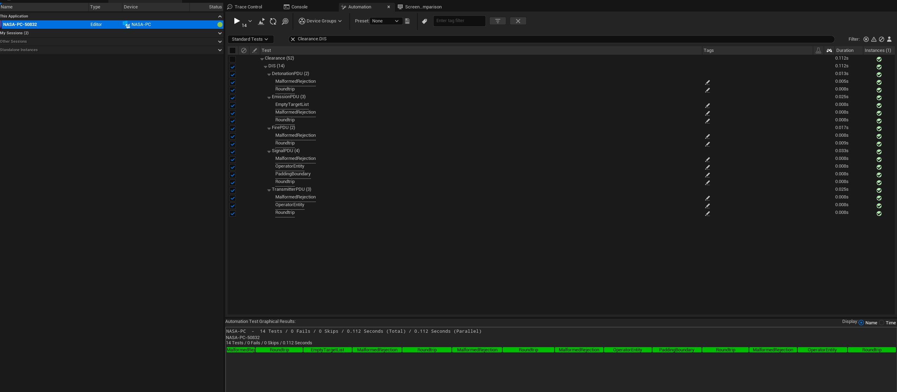

*Figure 1: Session Frontend Automation tab with the filter `clearance` applied,
running the full `Clearance.*` tree. Result bar reads
`52 Tests / 0 Fails / 0 Skips / 0.424 Seconds`. Every leaf in the
tree carries a green tick. Each test corresponds to one or more
REQ-IDs in `REQUIREMENTS.md`, so a green run is a receipt against
the requirements table above.*

</div>

## The federation panel

<div align="center">

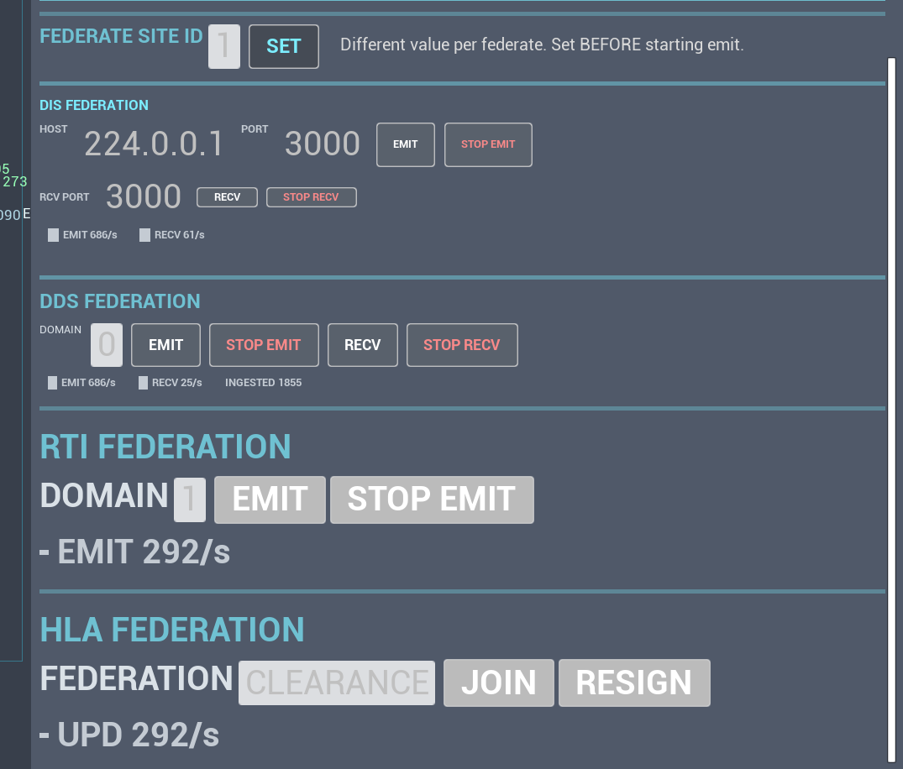

*Figure 2: Instructor Station federation panel with all four wires enabled
against the same running sim. DIS emitting to multicast
`224.0.0.1:3000` at 686 packets/sec with a 61/s receive echo; DDS on
domain 0 emitting 686/s and receiving 25/s with 1855 samples ingested;
RTI Connext on domain 1 emitting 292/s; HLA joined to the `CLEARANCE`
federation pushing 292/s attribute updates. Site ID 1 stamped on every
outbound entity. Each wire has its own EMIT / STOP EMIT / RECV /
STOP RECV controls plus live rate counters, so any wire can be turned
on or off independently.*

</div>

## IEEE 1278.1 on the wire

<div align="center">

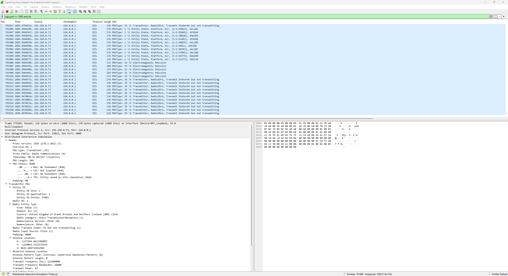

*Figure 3: Loopback capture with filter `udp.port == 3000 and dis` on a
running CLEARANCE session. Wireshark's built-in DIS dissector picks up
Entity State (PDU Type 1), Electromagnetic Emission (Type 23) and
Transmitter (Type 25) frames streaming to multicast `224.0.0.1`. The
expanded frame is a Transmitter PDU (Type 25, Radio Communications
family, PDU Length 104 bytes) fully decoded: header carrying **Proto
version: IEEE 1278.1-2012 (7)**, Entity ID `1:1:37092`, Radio ID 1,
Radio Entity Type resolved as **Kind: Radio (7) / Domain: Air (2) /
Country: United Kingdom of Great Britain and Northern Ireland (GBR)
(224) / Radio Category: Voice Transmission/Reception (1)**, Transmit
State `On but not transmitting`, Radio Input Source Pilot, ECEF
Antenna Location, Transmit Frequency 121500000 Hz (121.5 MHz ATC
guard), Bandwidth 25 kHz, Transmit Power 43 dBm. No custom dissector,
no wire shim, just a spec-compliant buffer that Wireshark can walk
field by field.*

</div>

<div align="center">

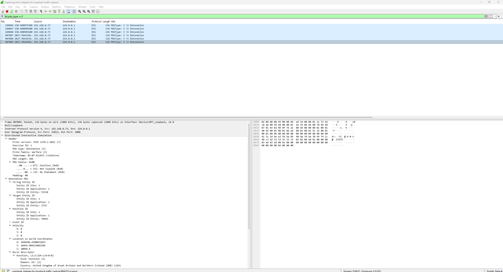

*Figure 4: Wireshark capture narrowed with `dis.pdu_type == 3` after an
intercept resolves. Warfare-family Detonation PDUs (Type 3, §7.4.4)
appear on the wire with PDU Length 104 bytes, the paired
Firing / Target / Munition entity IDs, an Event ID whose Event Number
matches the earlier Fire PDU, and Detonation Result byte 2 (Entity
Proximate Detonation). The "detonation" here is the DIS semantic used
for a non-lethal escort-out, not a lethal engagement. Same emit path
as every other PDU, no special-case wiring.*

</div>

<div align="center">

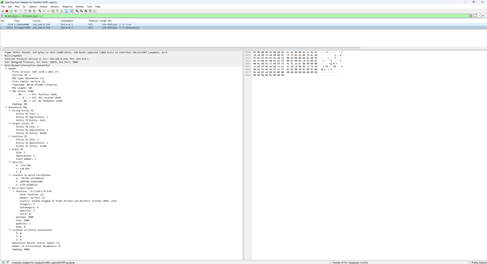

*Figure 4a: Wireshark capture narrowed with `dis.pdu_type == 2` at the
instant a ground-launched SAM is fired at an aircraft. Warfare-family
Fire PDU (Type 2, §7.4.3), PDU Length 96 bytes, carries the paired
Firing / Target / Munition entity IDs and an Event Number that will
appear again on the matching Detonation PDU. **Burst Descriptor
resolved as `Munition, (2:3:224:2:8:3:0)`**: SISO-REF-010 AIM-120B
under `Kind: Munition (2) / Domain: Surface (3) / Country: United
Kingdom of Great Britain and Northern Ireland (GBR) (224) / Category:
2 Guided / Subcategory: 8 AIM-120 family / Specific: 3 B-model`.
Domain 3 (Surface) is the honest classification for a surface-launched
SAM; the AMRAAM is repurposed as the warhead. Location field carries
the launcher's world-frame metres, Range field carries the true
launcher-to-target geometry at launch. Emitted from
`Plugins/ClearanceSim/Source/ClearanceSim/Private/Simulation/ClearanceMissile.cpp::QueueFireEvent`
through the shared warfare-event queue and out via the same
`ClearanceDIS::BuildFirePDU` codec used by any other weapons event.*

</div>

<div align="center">

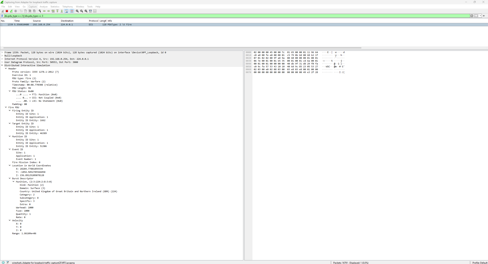

*Figure 4b: Detonation PDU (Type 3, §7.4.4) at the resolution of the
SAM engagement in Figure 4a, PDU Length 104 bytes. `Firing Entity`,
`Target Entity`, `Munition Entity`, `Event Number`, and full
`Burst Descriptor (2:3:224:2:8:3:0)` all mirror the earlier Fire PDU
so a federation observer can pair the two purely by wire content.
`Detonation Result: Entity Impact (1)` confirms an actual proximity
intercept - the target aircraft was hit and dies through the same
mayday-descent + crash-site pipeline as any other airframe loss.
Emitted from `ClearanceMissile.cpp::OnTerminationDetected` through
the same warfare-event queue and `ClearanceDIS::BuildDetonationPDU`
codec used everywhere else.*

</div>

<div align="center">

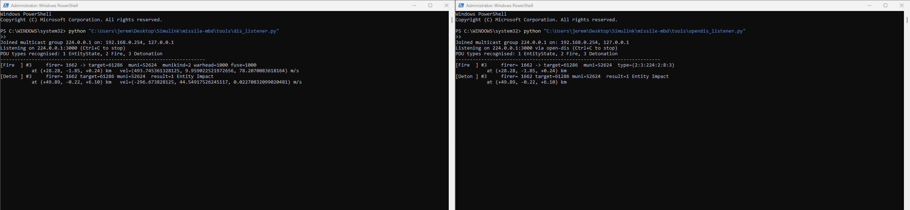

*Figure 4c: Two independent IEEE 1278.1 decoders reading the same
multicast traffic and producing matching output. **Left**: a
hand-rolled ~230-line Python decoder using only the Python
standard library (`missile-mbd/tools/dis_listener.py`). **Right**:
a listener backed by the third-party
[open-dis-python](https://github.com/open-dis/open-dis-python)
library authored by a different team
(`missile-mbd/tools/opendis_listener.py`). Firing Entity 1662,
Munition Entity ID 52624, Event Number 3, `Result: 1 Entity
Impact`, and Burst Descriptor `(2:3:224:2:8:3)` AIM-120B all
agree byte for byte across both decoders. Fire location 28 km,
Detonation 50 km, a plausible short-range SAM engagement. Two
independent implementations producing identical output on the same
bytes is real IEEE 1278.1 compliance evidence: neither
implementation is validating its own emitter. Wireshark's built-in
DIS dissector (Figures 3-4b) is a third such implementation and
also agrees.*

</div>

<div align="center">

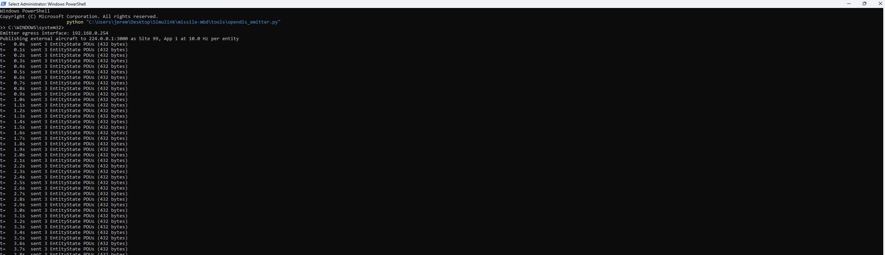

*Figure 4d: CLEARANCE's aircraft list ingesting three foreign
contacts (EXT_A320, EXT_F35, EXT_MIG29) published by a third-party
Python emitter (`missile-mbd/tools/opendis_emitter.py`, built on
open-dis-python). Each row carries the "SITE 99" chip marking a
non-local federate. Proves the other direction of interop:
`ClearanceDISReceiver` correctly ingests EntityState PDUs
published by a completely different IEEE 1278.1 implementation
on the same wire.*

</div>

<div align="center">

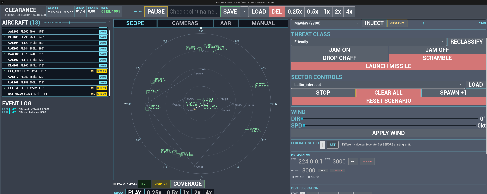

*Figure 4e: Same three foreign contacts visible on CLEARANCE's
scope, orbiting slowly at the sector centre - published by the
Python emitter's synthetic-orbit code and rendered by CLEARANCE's
normal aircraft-symbol pipeline. Same actor code paths as any
locally-spawned aircraft, driven purely by the received DIS
EntityState PDUs. Together with Figures 4a-c, this closes the
bidirectional IEEE 1278.1 interop loop: CLEARANCE's emit is
decodable by third parties, and CLEARANCE's receive ingests
third-party emit.*

</div>

<div align="center">
  
https://github.com/user-attachments/assets/f5ac9e1c-f745-4743-90ea-b0fd9aa54d91

*Video 1 - DIS across LAN. PC A (`192.168.0.254`, `CLEARANCE`)
emitting IEEE 1278.1 DIS Entity State / Fire / Detonation PDUs. PC B
(`192.168.0.33`, `opendis_listener.py`) decoding the same PDUs live
on a separate physical machine one LAN hop away using the independent
open-source `opendis` Python library - zero shared code with
CLEARANCE. `LAUNCH MISSILE` click on PC A produces matched `[Fire ]`
+ `[Deton ]` rows on PC B. Multicast doesn't traverse the mesh pods
between wired-to-different-nodes, so CLEARANCE was pointed at PC B's
unicast IP for delivery - the wire format itself is unchanged.*

</div>

<div align="center">

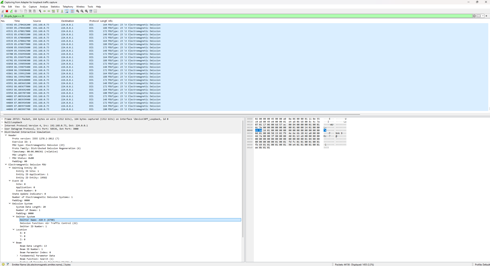

*Figure 5: Wireshark capture narrowed with `dis.pdu_type == 23` while the
CLEARANCE radar sim is ticking against live traffic. Distributed
Emission Regeneration (family 6) frames appear at the sim tick rate,
one Emission PDU per active radar per tick. The expanded frame
(Emitting Entity `1:1:19582`) shows the full radar fingerprint under
`Emission System` → `Emitter System`: **`Emitter Name: ASR-9 (8790)`**
(SISO-REF-010 UID 75), **`Emission Function: Air Traffic Control (22)`**
(SISO-REF-010 UID 76), one Beam with **`Beam Function: Search (1)`**
(SISO-REF-010 UID 78), plus `Fundamental Parameter Data` carrying
centre frequency, PRF, pulse width and effective radiated power. The
three highlighted enum values are the exact fields called out in
`REQUIREMENTS.md` and `ARCHITECTURE.md`, decoded independently by
Wireshark's own DIS dissector: third-party proof that the wire codec
writes SISO-conformant values.*

</div>

## Wire codec API

<div align="center">

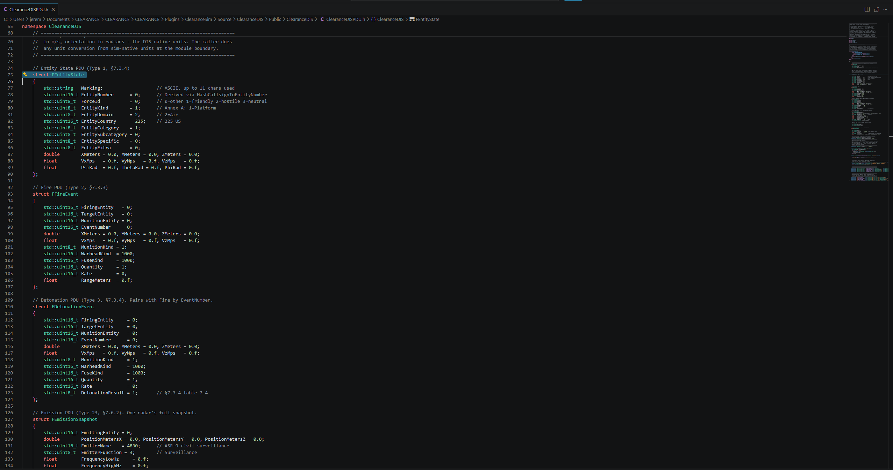

*Figure 6: Excerpt from `ClearanceDISPDU.h` inside `namespace ClearanceDIS`
showing the POD struct declarations for the first four PDU types:
`FEntityState` (Type 1, §7.3.2), `FFireEvent` (Type 2, §7.4.3),
`FDetonationEvent` (Type 3, §7.4.4) and `FEmissionSnapshot` (Type 23,
§7.6.2). Every field is a `std::uint*_t`, `float`, `double` or
`std::string`. No Unreal types anywhere on the boundary. The rest of
the header (elided) declares the equivalent `FTransmitterState` and
`FSignalEvent` structs plus the eleven `CLEARANCEDIS_API` Build /
Parse free functions, and the neighbouring `test/CMakeLists.txt`
compiles a round-trip test suite against this same header with no
engine dependency, which is what makes the codec reusable outside
CLEARANCE.*

</div>

## OMG DDS via Fast DDS, discovered by RTI's own tooling

<div align="center">

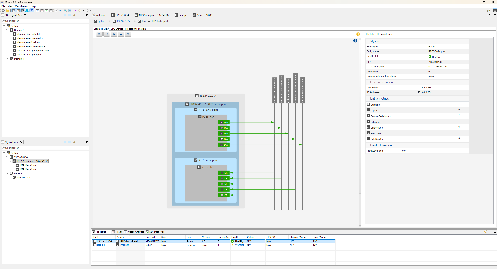

*Figure 7: RTI Administration Console discovering the Fast DDS side of CLEARANCE
on Domain 0 as an `RTPSParticipant` on host `192.168.0.254`. The
graphical view resolves one Publisher with six DataWriters and one
Subscriber with six DataReaders (the in-process sanity subscriber)
against the six `clearance/*` Topics visible in the DDS Logical View
on the left. Entity Info panel confirms it: Topics 6, DataWriters 6,
Subscribers 1, DataReaders 6. Product Version reads `0.0` and there
is no RTI Vendor line because this participant is not RTI Connext,
it's eProsima Fast DDS speaking standard OMG DDS-RTPS 2.5 on the wire.
The fact that RTI's own tool discovers it and walks its topology is
proof the schema is vendor-neutral OMG DDS, not accidentally
Fast-DDS-specific.*

</div>

<div align="center">

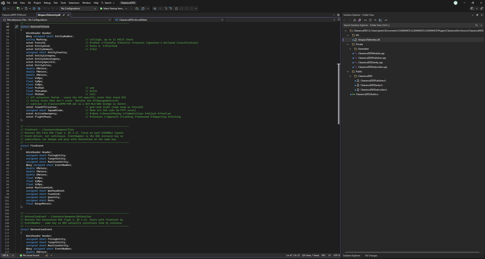

*Figure 8: `AirspaceTelemetry.idl` open in Visual Studio, showing the
`AircraftState` and `FireEvent` struct declarations (with
`DetonationEvent` appearing below). `AircraftState` carries the DIS
Entity State field set (ForceId, EntityKind / Domain / Country /
Category, `XMeters/YMeters/ZMeters` ECEF position, velocity, radians
orientation) plus the ATC-specific extension fields (`TrueAffiliation`,
`SquawkCode`, `ActiveEmergency`, `FlightPhase`) whose comments cite the
`ATCManagedAircraft` subclass in `ClearanceRPR-FOM.xml`: same schema,
DIS-side and HLA-side. This one IDL is what Fast DDS's `fastddsgen`
and RTI Connext's `rtiddsgen` both code-generate from, encoding the
six topics (`AircraftState`, `EmissionSnapshot`, `TransmitterState`,
`SignalEvent`, `FireEvent`, `DetonationEvent`) on the wire as OMG CDR
inside RTPS 2.5.*

</div>

<div align="center">
  
https://github.com/user-attachments/assets/66ca54fc-26b2-4e81-93e2-815618854712

*Video 3. Fast DDS across LAN. PC A (`192.168.0.254`, `CLEARANCE`)
publishing the six `clearance/*` topics via eProsima Fast DDS 3.6.
PC B (`192.168.0.33`, `clearance_dds_subscriber.exe`) subscribing
from a separate process on a separate physical machine, built from
the same IDL but linked and launched independently. `SCRAMBLE` /
`LAUNCH MISSILE` on PC A produces matched `[FireEvent]` and
`[DetonationEvent]` lines on PC B alongside continuous
`[AircraftState]` / `[EmissionSnapshot]` scroll. Fast DDS defaults
to multicast for participant discovery, which the mesh pods drop.
Forced unicast via a `fastdds_lan.xml` profile on each PC declaring
the other PC's IP in `<initialPeersList>`, no code changes to
publisher or subscriber, pure config.*

</div>

## OMG DDS via RTI Connext, discovered by RTI Administration Console

<div align="center">

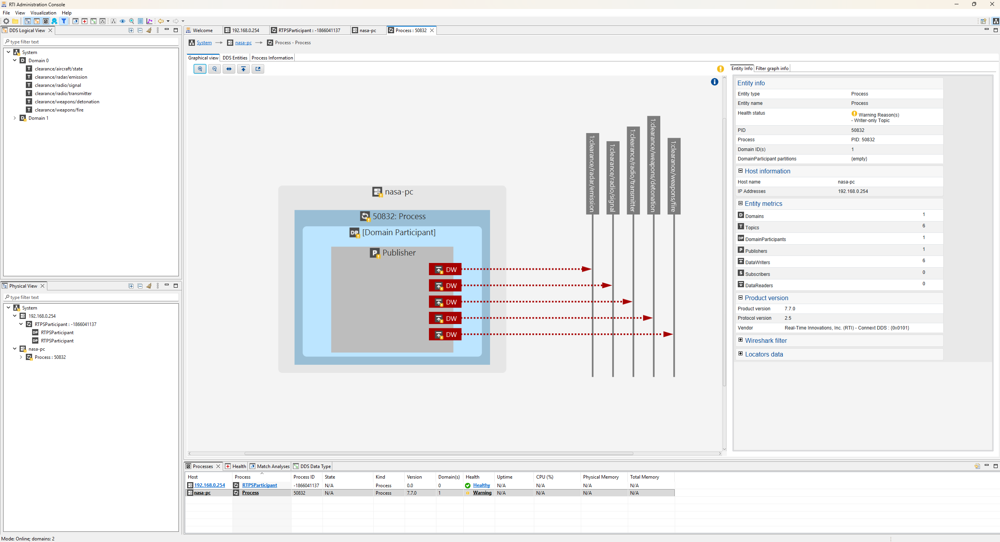

*Figure 9: Same RTI Admin Console, this time on Domain 1 looking at the
CLEARANCE editor process (`nasa-pc`, PID 50832). One DomainParticipant,
one Publisher, six DataWriters on the same six `clearance/*` topics as
the Fast DDS wire; Entity metrics panel confirms Topics 6,
DomainParticipants 1, Publishers 1, DataWriters 6, Subscribers 0,
DataReaders 0 (publisher-only side). Product version reads 7.7.0,
Protocol version 2.5, Vendor `Real-Time Innovations, Inc. (RTI) -
Connext DDS : {0x0101}`. A vendor runtime with a valid licence
populates this window. Screenshots of code do not.*

</div>

## IEEE 1516-2010 HLA-Evolved

<div align="center">

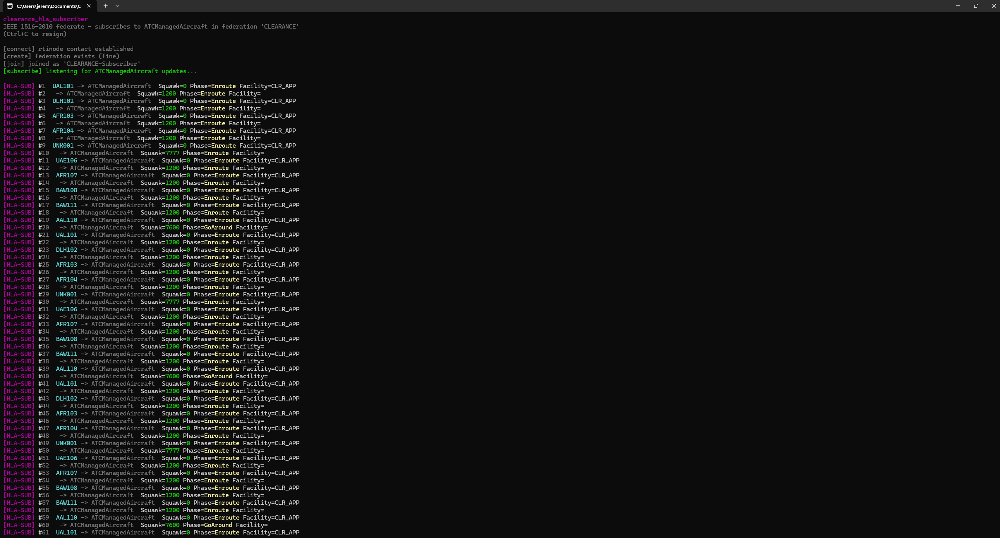

*Figure 10: External `clearance_hla_subscriber.exe` federate proving the CLEARANCE
side is publishing to a real federation, not into a void. It runs as
an independent IEEE 1516-2010 process, contacts `rtinode.exe`, joins
the same `CLEARANCE` federation execution as `CLEARANCE-Subscriber`,
subscribes to `ATCManagedAircraft`, and starts printing incoming
attribute updates in real time. The `[HLA-SUB] #N <callsign> ->
ATCManagedAircraft Squawk=... Phase=... Facility=...` lines are
live attribute updates coming out of the CLEARANCE editor, including
the emergency squawks (7500 hijack, 7600 NORDO, 7700 general) and
`GoAround` phase transitions as they happen in the scope. The
federation contract itself (FOM Module `ClearanceRPR-FOM.xml`
extending SISO RPR-FOM 2.0's
`HLAobjectRoot.BaseEntity.PhysicalEntity.Platform.Aircraft` with an
`ATCManagedAircraft` subclass, HLAfloat64BE for world coordinates,
HLAinteger16BE for squawk, HLAfixedRecord for the EntityIdentifier
{Site, App, Entity} triple, HLAopaqueData for the 11-char Marking) is
what makes this cross-process interop possible.*

</div>

<div align="center">

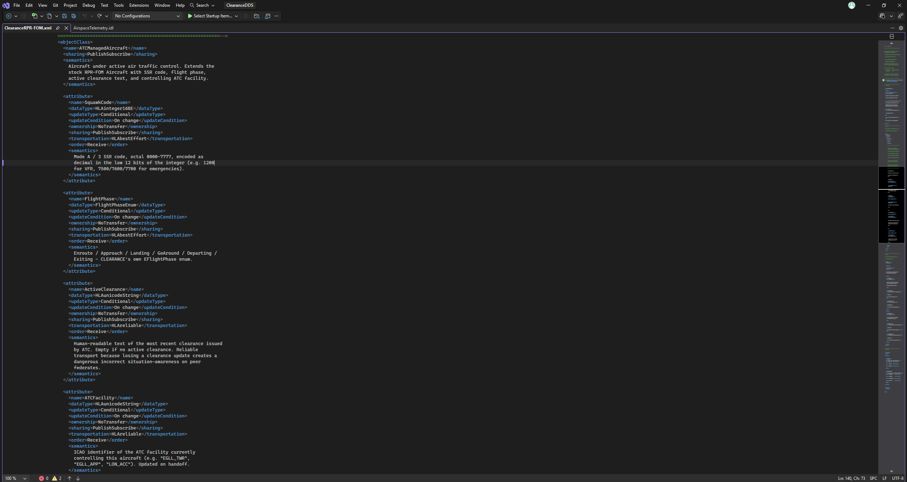

*Figure 11: The `<objectClass>` block for `ATCManagedAircraft` inside
`ClearanceRPR-FOM.xml`, opened in Visual Studio. The class extends the
stock RPR-FOM `Aircraft` with four attributes: `SquawkCode` as
`HLAinteger16BE` (Mode A / 3 SSR, octal 0000-7777 in the low 12 bits),
`FlightPhase` as `FlightPhaseEnum` (Enroute / Approach / Landing /
GoAround / Departing / Exiting), `ActiveClearance` as
`HLAunicodeString` (human-readable clearance text, `HLAreliable`
transport because losing a clearance update creates a dangerous
situation-awareness gap on peer federates), and `ATCFacility` as
`HLAunicodeString` (ICAO identifier of the controlling facility). Each
attribute declares its full HLA semantics (`sharing`,
`transportation`, `order`, `ownership`) per IEEE 1516-2010 and carries
a `<semantics>` block documenting the ATC domain rule.*

</div>

### Cross-vendor RTI validation (Portico)

CLEARANCE currently links against OpenRTI. To test that the FOM and
the federation contract are portable across implementations rather
than OpenRTI-flavoured HLA, the `PorticoFederate/` folder ships a
minimal Java federate (`ClearanceFOMTest.java`) that runs against
[Portico](https://github.com/openlvc/portico), an independent
IEEE 1516-2010 implementation developed by a different team than
OpenRTI. Run it against any FOM URL - it connects, creates the
federation, joins, resigns, destroys, and reports success or the
exact FOM error line.

<div align="center">

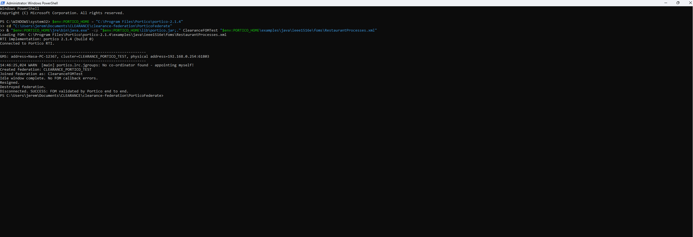

*Figure 12: `ClearanceFOMTest.java` running against Portico's own
Restaurant example FOM (a known-good IEEE 1516-2010 module that
ships with Portico). Portico 2.1.4 loads the FOM, creates the
`CLEARANCE_PORTICO_TEST` federation, brings up a jgroups cluster
under the covers, the federate joins as `ClearanceFOMTest`, waits
for FOM callbacks, resigns, destroys the federation, disconnects
cleanly. Confirms the Java federate, Portico runtime, and the
`ClearanceFOMTest` logic all work end to end.*

</div>

<div align="center">

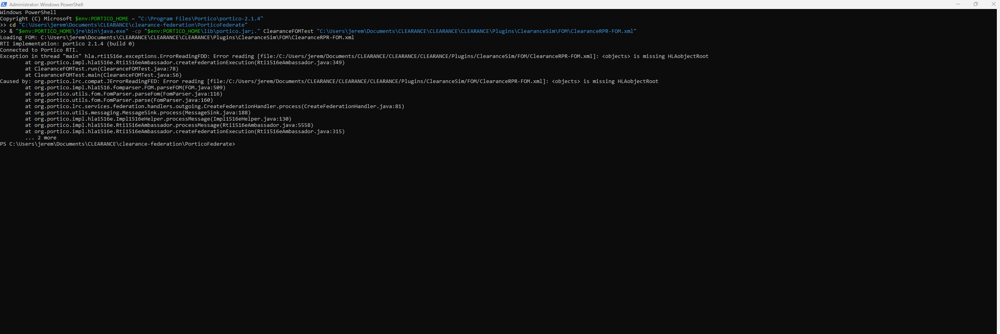

*Figure 13: Same federate pointed at CLEARANCE's own
`ClearanceRPR-FOM.xml`. Portico's stricter IEEE 1516-2010 parser
rejects it with `ErrorReadingFDD: <objects> is missing HLAobjectRoot`,
even though the file DOES declare `HLAobjectRoot` inside `<objects>`
(visible in Figure 11's surrounding structure). OpenRTI accepts the
same file leniently and drives the federation successfully (Figure
10), so this is a real cross-vendor compatibility gap that
third-party testing exposed - exactly what independent-RTI validation
is meant to catch. Follow-ups tracked in
[`PorticoFederate/README.md`](PorticoFederate/README.md): compare
`<objects>` byte-for-byte against Portico's Restaurant example, and
try loading the SISO RPR-FOM 2.0 base module alongside the CLEARANCE
extension via `createFederationExecution(name, URL[])` so the parent
inheritance chain the extension references is present at parse time.
Portfolio takeaway: real HLA interop requires testing against multiple
RTIs, not just the one you happen to build against. `PorticoFederate`
is that test.*

</div>

## Architecture principles

Every wire codec is a **standalone C++ module** with an engine-free
public API. Zero Unreal types across the boundary. No `FName`, no
`FVector`, no `TArray`, no `UObject`.

- **`ClearanceDIS`** exposes POD structs (`FEntityState`,
  `FFireEvent`, `FDetonationEvent`, `FEmissionSnapshot`,
  `FSignalEvent`, `FTransmitterState`) and eleven Build/Parse free
  functions. `std::vector`, `std::string`, `<cstdint>` on the
  surface, nothing else. Tests exercise the pure API directly, not
  through the UE adapter.

- **`ClearanceDDS` and `ClearanceRTI`** expose PImpl facades
  (`FClearancePublisher`, `FClearanceSubscriber` and the RTI
  equivalents) so Fast DDS / RTI Connext types don't leak across
  the module boundary. POD data types come from the vendor's IDL
  code generator.

- **`ClearanceHLA`** exposes `FClearanceHLAFederate` with a
  six-method API (`CreateFederation`, `Join`,
  `RegisterAircraftInstance`, `UpdateAircraftAttributes`,
  `PublishAircraftState`, `Resign`). All rti1516e types live inside
  the PImpl.

The Unreal-tied adapters (`UClearanceDISEmitter`,
`UClearanceDDSEmitter`, `UClearanceRTIEmitter`,
`UClearanceHLAEmitter`) are thin. They read the sim's authoritative
struct, convert to POD at the module boundary, call the pure API,
and hand results back. The wire-format code doesn't know Unreal
exists.

This is the shape a defence integrator expects. The wire format
code should be a portable protocol library, not scattered helpers
wired into a game engine. All four wires ship it that way.

## Real ABI-level integration

Getting four independent commercial runtimes to co-exist in one UE5
process required real toolchain work, not just header includes.
Notable bugs hit and fixed during OpenRTI + RTI Connext integration:

- **CMake 4.x compatibility.** OpenRTI's top-level `CMakeLists.txt`
  called `project()` before `cmake_minimum_required(VERSION 2.8.12)`,
  and CMake 4 removed compat for <3.5. Patched to insert
  `cmake_minimum_required(VERSION 3.5)` as line 1.

- **`auto_ptr` vs `unique_ptr` ABI mismatch.** `rti1516e/RTI/SpecificConfig.h`
  gates `RTI_UNIQUE_PTR` on `__cplusplus < 201703L`. MSVC reports
  `__cplusplus == 199711L` by default even in C++17 mode unless
  `/Zc:__cplusplus` is set. OpenRTI built without the flag exported
  `createRTIambassador` returning `std::auto_ptr<RTIambassador>`, but
  the UE consumer (C++20) saw `std::unique_ptr` in the header, so
  link failed at RTIambassador creation. Fixed by rebuilding OpenRTI
  with `CXXFLAGS = /EHsc /Zc:__cplusplus`.

- **`<windows.h>` pollution from rti1516e headers.** Same class of
  problem as RTI Connext: `<windows.h>` transitively leaks into UE
  headers and breaks `UE::Cook::FCookDependency`. Fixed by wrapping
  every OpenRTI include with UE's
  `AllowWindowsPlatformTypes.h` + `THIRD_PARTY_INCLUDES_START` +
  `THIRD_PARTY_INCLUDES_END` + `HideWindowsPlatformTypes.h` guard set.

- **Cross-DLL heap mismatch in Fast DDS.** Dynamic linking Fast DDS
  hit a Windows cross-DLL heap crash: Fast DDS's DLL allocated an
  `std::vector` inside its type-registration path, then `ClearanceDDS`'s
  DLL tried to free it against UE's `PerModuleInline` allocator.
  Different heaps. Switched to statically linking
  `libfastdds-3.6.lib` + `libfastcdr-2.3.lib` +
  `foonathan_memory-0.7.4.lib` + OpenSSL statics into
  `UnrealEditor-ClearanceDDS.dll`. One heap, one STL, no mismatch
  possible.

Every one of the four vendor SDKs is vendored under
`Plugins/ClearanceSim/ThirdParty/` in the parent project (headers,
libs, DLLs, and in OpenRTI's case the standalone `rtinode.exe`
federation runtime).

## Repository layout

```
clearance-federation/
|-- README.md
|-- ARCHITECTURE.md                             <-- module-by-module deep dive
|-- LICENSE                                     <-- MIT
|-- docs/
|   `-- img/                                    <-- README screenshots
|-- ClearanceDIS/                               <-- IEEE 1278.1, in-house codec
|   |-- ClearanceDIS.Build.cs                   <-- UE plugin module build script
|   |-- Public/
|   |   `-- ClearanceDIS/
|   |       `-- ClearanceDISPDU.h               <-- ALL public API in one file
|   |-- Private/
|   |   |-- ClearanceDISModule.cpp              <-- module lifecycle
|   |   `-- DISWireFormat.cpp                   <-- 6 Build + 5 Parse implementations
|   `-- test/
|       |-- CMakeLists.txt                      <-- standalone build (no UE)
|       `-- test_wire_format.cpp                <-- round-trip PDU tests
|-- ClearanceDDS/                               <-- OMG DDS via Fast DDS 3.6.1
|   |-- ClearanceDDS.Build.cs                   <-- static-link Fast DDS + fastcdr + foonathan_memory
|   |-- IDL/
|   |   `-- AirspaceTelemetry.idl               <-- 6 topics: AircraftState, EmissionSnapshot, TransmitterState, SignalEvent, FireEvent, DetonationEvent
|   |-- Public/                                 <-- FClearancePublisher + FClearanceSubscriber facades
|   `-- Private/                                <-- PImpl impls hiding Fast DDS types
|-- ClearanceRTI/                               <-- OMG DDS via RTI Connext 7.7.0
|   |-- ClearanceRTI.Build.cs
|   |-- IDL/                                    <-- Same schema, generated via RTI's rtiddsgen
|   |-- Public/                                 <-- FClearanceRTIPublisher facade
|   `-- Private/                                <-- Connext DataWriter wiring
`-- ClearanceHLA/                               <-- IEEE 1516-2010 HLA-Evolved via OpenRTI 0.10.0
    |-- ClearanceHLA.Build.cs
    |-- Public/
    |   `-- ClearanceHLAFederate.h              <-- 6-method federate API (POD only)
    `-- Private/
        |-- ClearanceHLAFederate.cpp            <-- Join / Publish / Resign impl
        `-- fom/
            `-- ClearanceRPR-FOM.xml            <-- FOM Module extending RPR-FOM 2.0
```

## Standards referenced

- **IEEE 1278.1-2012** - *Distributed Interactive Simulation, Application Protocols*. PDU section numbering (§7.3.2 Entity State, §7.4.3 Fire, §7.4.4 Detonation, §7.6.2 Emission, §7.7.2 Transmitter, §7.7.3 Signal) traces back here.
- **SISO-REF-010-2025 (v36)** - *Reference for Enumerations for Simulation Interoperability*. Ground truth for every DIS enum value CLEARANCE writes on the wire: UID 75 Emitter Name (`8790 = ASR-9`), UID 76 Emitter System Function (`22 = Air Traffic Control`), UID 78 Beam Function (`1 = Search`), UID 8 Domain (`2 = Air`), Country codes (`224 = GBR`), Force ID, Detonation Result. Free download from https://www.sisostandards.org/page/ReferenceDocuments.
- **OMG DDS 1.4** - *Data Distribution Service for Real-time Systems*
- **OMG DDS-RTPS 2.5** - *Real-Time Publish-Subscribe Wire Protocol*
- **OMG DDS-XTypes 1.3** - *Extensible and Dynamic Topic Types for DDS*
- **IEEE 1516-2010** - *Modeling and Simulation High Level Architecture (HLA-Evolved)*
- **SISO-STD-001-2015** - *RPR-FOM 2.0 Reference Federation Object Model*
- **ICAO Doc 4444** - *Procedures for Air Navigation Services - Air Traffic Management* (referenced by safety tests)

### Independent cross-references

Structural claims in this repo (PDU byte sizes, protocol family assignments, DIS version 7 = IEEE 1278.1-2012) are corroborated against open-source DIS implementations and third-party dissectors, not just the paid IEEE PDF:

- **KDIS**: open-source C++ DIS library (BSD-2-Clause), https://github.com/karljj1/kdis. `_SIZE` constants and folder structure independently confirm byte sizes (`ENTITY_STATE_PDU_SIZE = 144`, `FIRE_PDU_SIZE = 96`, `DETONATION_PDU_SIZE = 104`, `TRANSMITTER_PDU_SIZE = 104`) and family groupings (`PDU/Warfare/`, `PDU/Radio_Communications/`, `PDU/Distributed_Emission_Regeneration/`). Its Build Option table also confirms `DIS_VERSION = 7` corresponds to IEEE 1278.1-2012.
- **Wireshark DIS dissector**: `epan/dissectors/packet-dis.c` in https://github.com/wireshark/wireshark. The same dissector used in Figures 3-5 of this README decodes CLEARANCE's PDUs cleanly. Its enum-string tables (`DIS_PDU_Emitter_System_Function_Strings[]`, `DIS_PDU_Electromagnetic_Emission_Beam_Function_Strings[]`, `DIS_PDU_Radio_Category_Strings[]`) resolve on-wire values to the SISO-REF-010 names in real time: the `EmitterFunction = 22 → "Air Traffic Control"`, `BeamFunction = 1 → "Search"` and `Radio Category = 1 → "Voice Transmission/Reception"` decodes visible in the figures are Wireshark's, not ours. The dissector's internal protocol-version constant `DIS_VERSION_IEEE_1278_1_2012` independently confirms our `protocol_version = 7 = IEEE 1278.1-2012` claim.
- **SISO-REF-010-2025 v36**: as above, the enumerations catalogue.

The specific IEEE 1278.1-2012 sub-section indices (`§7.x.y.z`) cited in this repo and in the code comments are nominal citations against the IEEE standard's table of contents and are not independently verified against the IEEE PDF, which is a paid document.

## Video walkthrough

Full technical walkthrough of the federation stack against a live
CLEARANCE session: DIS PDUs decoded live in Wireshark, DDS
participant discovered in RTI Administration Console, OpenRTI
federate joining an RPR-FOM 2.0 federation, all four wires ticking
side by side in the instructor UI, and a two-federate live demo
where two independent CLEARANCE processes share an airspace picture
over all four wires simultaneously.

https://youtu.be/u7qeIkqkt4s

| Timestamp | Section |
|---|---|
| 00:00 | Intro |
| 00:10 | IEEE 1278.1 DIS: six PDU types |
| 00:36 | Wireshark DIS capture |
| 02:40 | Intercept scramble on the wire |
| 03:45 | Detonation PDU (Type 3) in Wireshark |
| 04:50 | Voice command + radio PDUs in Wireshark |
| 06:10 | ClearanceDISPDU.h wire codec |
| 07:06 | OMG DDS via Fast DDS 3.6.1: six topics |
| 07:40 | AirspaceTelemetry.idl schema |
| 08:04 | DDS federation live |
| 09:07 | 44 automation tests, 61 REQ-IDs *(now 52 tests / 69 REQs: see note below)* |
| 09:49 | OMG DDS via RTI Connext 7.7.0 |
| 10:20 | RTI Connext Administration Console |
| 11:40 | IEEE 1516-2010 HLA-Evolved via OpenRTI |
| 12:15 | rtinode.exe federation runtime |
| 13:25 | FOM Module XML extending RPR-FOM 2.0 |
| 14:11 | HLA subscriber |
| 15:19 | Back-end network architecture summary |
| 16:07 | Two-federate live demo |

> **Note on the video capture.** The walkthrough was recorded against
> an earlier build in which the DIS emitter still wrote protocol
> version byte `6` (IEEE 1278.1a-1998), the Transmitter PDU's Radio
> Entity Type Category was `5` (which Wireshark decodes as
> "ILS Localizer"), and the Entity / Munition / Radio Entity Country
> byte was `225` (United States of America). All three were tightened
> in a later pass: the emitter now writes protocol version `7`
> (IEEE 1278.1-2012), Radio Category `1` (Voice Transmission/Reception,
> the SISO-REF-010 name for a standard VHF ATC comm radio), and
> Country `224` (United Kingdom of Great Britain and Northern Ireland,
> matching the sim's Warton / EGNO airfield location). The automation
> test count and REQ-ID count also grew after recording: the video
> shows `44 automation tests / 61 REQ-IDs` at 09:07; the current repo
> ships `52 automation tests / 69 REQ-IDs` following subsequent radar
> and safety-domain additions. All the drifted values match what
> `REQUIREMENTS.md` and the Figures 3 and 4 screenshots claim. Every
> other detail in the video (PDU sizes, families, byte offsets, topic
> names, HLA object class, ForceId mapping) is unchanged.

Companion Model-Based Design video from the same simulator (Simulink
autopilot flying every aircraft, Simulink radar signal chain
detecting every one): https://youtu.be/nqjFOimsYHw

## License

MIT, see [`LICENSE`](LICENSE). Vendor SDKs referenced by the modules
(eProsima Fast DDS 3.6.1, RTI Connext DDS 7.7.0, OpenRTI 0.10.0)
carry their own licences and are not redistributed here. See the
parent CLEARANCE build documentation for vendored-runtime layout.
